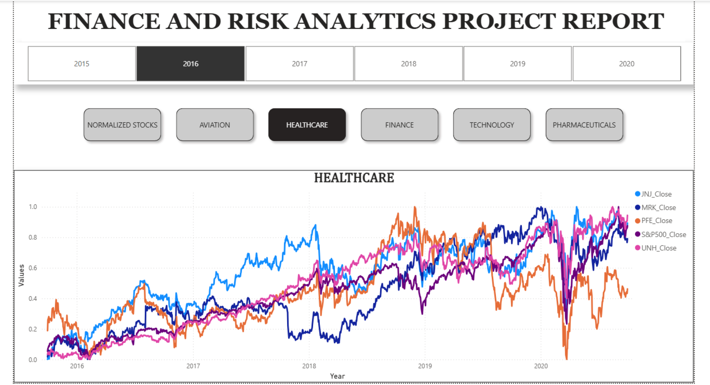

# 📈 Investment Portfolio Analytics using Python & Power BI

### End-to-End Financial Analytics Solution for Risk Assessment, Portfolio Optimization, and Investment Decision Support

## 📖 Project Overview

This project presents an end-to-end financial analytics solution developed to support investment portfolio decision-making through data-driven insights. By analyzing historical stock market data across multiple industries, the project evaluates investment performance, portfolio risk, and return potential to recommend portfolios aligned with different investor risk profiles.

The solution combines Python-based data analysis, statistical modeling, and interactive Power BI visualizations to transform raw financial data into actionable business insights. It demonstrates the complete analytics lifecycle—from data cleaning and exploratory data analysis (EDA) to portfolio optimization and executive dashboard reporting.

As part of a two-member capstone project, I contributed to data preprocessing, exploratory data analysis, financial performance analysis, business insight generation, and the development of the interactive Power BI dashboard.

## 📌 Project at a Glance

| Category | Details |
|----------|---------|
| **Project Type** | Financial Analytics & Business Intelligence |
| **Domain** | Investment Portfolio Management |
| **Duration** | Capstone Project |
| **Team Size** | 2 Members |
| **Role** | Data Analysis, Financial Analytics, Power BI Dashboard Development |
| **Tools Used** | Python, Pandas, NumPy, Matplotlib, Seaborn, Plotly, Power BI, Power Query |
| **Dataset** | Historical Stock Market Data (24 Companies, 5 Industries, 2010–2020) |
| **Outcome** | Investment Portfolio Recommendations based on Risk & Return Analysis |

## ⭐ Project Highlights

- 📊 Analyzed historical stock market data for **24 companies** across **5 industries**.
- 📈 Evaluated investment performance using **Annualized Returns**, **Cumulative Returns**, and **Sharpe Ratio**.
- ⚖️ Compared portfolio risk and return to support informed investment decisions.
- 👥 Designed personalized investment recommendations for **Conservative** and **Aggressive** investor profiles.
- 📉 Assessed market behavior during significant events, including the **COVID-19 pandemic**.
- 📊 Developed an interactive **Power BI Executive Dashboard** to communicate insights effectively.

## 📑 Table of Contents

- [Project Overview](#-project-overview)
- [Project at a Glance](#-project-at-a-glance)
- [Business Problem](#-business-problem)
- [Client Scenario](#-client-scenario)
- [Technology Stack](#️-technology-stack)
- [Dataset](#-dataset)
- [Methodology](#-methodology)
- [Executive Dashboard](#-executive-dashboard)
- [Executive Summary & Business Insights](#-executive-summary-&-business-insights)
- [Business Recommendations](#-business-recommendations)
- [My Contribution](#-my-contribution)
- [Repository Structure](#-repository-structure)
- [Future Enhancements](#-future-enhancements)

## ▶️ How to Run the Project

1. Clone this repository.
2. Open the Jupyter Notebook to review the complete data analysis workflow.
3. Explore the Power BI dashboard using the `.pbix` file.
4. Review the project presentation for the business context and key findings.
5. Refer to the Executive Dashboard image for a quick overview of the solution.

## 📊 Project Metrics

| Metric | Value |
|---------|------:|
| Industry Domains | 5 |
| Companies Analyzed | 24 |
| Historical Data | 10 Years |
| Investor Profiles | 2 |
| Dashboard Pages | 1 |
| Analysis Environment | Jupyter Notebook |
| Dashboard Tool | Power BI |

> **Note**
>
> This project was developed for educational and portfolio purposes. The investment insights presented are based on historical market data and should not be interpreted as financial advice.

### 🎯 Business Objective

To analyze historical stock performance across multiple industry sectors and develop personalized investment recommendations for investors with varying financial goals and risk tolerance, enabling informed and data-driven portfolio decisions.

## 🎯 Business Problem

Investors often face challenges when selecting stocks and constructing portfolios that align with their financial goals and risk tolerance. With hundreds of investment options available across multiple industries, making informed investment decisions requires a structured analysis of historical performance, risk exposure, and return potential.

Traditional investment decisions based solely on intuition or market trends may lead to suboptimal portfolio performance and increased financial risk. Therefore, there is a need for a data-driven approach that evaluates stock behavior, identifies high-performing assets, and balances risk against expected returns.

This project addresses this challenge by analyzing historical stock market data from multiple sectors, measuring key financial performance indicators, and generating personalized portfolio recommendations for investors with different risk profiles. The analysis enables investors to make more informed decisions based on quantitative evidence rather than speculation.

## 👥 Client Scenario

The project was designed to provide investment recommendations for two hypothetical investors with distinct financial objectives and risk tolerance levels.

### Investor 1 – Conservative Investor

A risk-conscious investor seeking stable long-term growth while minimizing portfolio volatility. The objective was to construct a diversified portfolio consisting of relatively lower-risk stocks capable of delivering consistent returns.

### Investor 2 – Aggressive Investor

A growth-focused investor willing to accept higher levels of risk in pursuit of significantly higher returns. The objective was to identify high-performing stocks with strong growth potential and maximize portfolio returns over the investment horizon.

By analyzing stock performance, risk metrics, cumulative returns, and Sharpe ratios, tailored portfolio recommendations were developed for each investor profile.

## 🛠️ Technology Stack

| Technology                | Purpose                                                                                            |
| ------------------------- | -------------------------------------------------------------------------------------------------- |
| **Python**                | Data cleaning, preprocessing, financial analysis, portfolio analysis, and statistical calculations |
| **Pandas**                | Data manipulation and transformation                                                               |
| **NumPy**                 | Numerical computations and financial calculations                                                  |
| **Matplotlib**            | Data visualization and trend analysis                                                              |
| **Seaborn**               | Statistical visualizations and correlation analysis                                                |
| **Plotly**                | Interactive exploratory visualizations                                                             |
| **Jupyter Notebook**      | Exploratory Data Analysis (EDA) and analytical workflow                                            |
| **Power BI**              | Interactive executive dashboard and KPI reporting                                                  |
| **Power Query**           | Data transformation and preparation for dashboard reporting                                        |
| **Microsoft Excel / CSV** | Source dataset for stock market analysis                                                           |

## 📂 Dataset

The project uses historical stock market data covering **24 publicly traded companies** across **five major industries** over a **10-year period (October 2010 – September 2020)**.

For portfolio analysis and investment recommendations, the most recent **five years of data (October 2015 – September 2020)** were analyzed to better reflect contemporary market behavior.

### Industries Included

* ✈️ Aviation
* 💰 Finance
* 🏥 Healthcare
* 💊 Pharmaceuticals
* 💻 Technology

### Key Dataset Attributes

* Stock Symbol
* Date
* Open Price
* High Price
* Low Price
* Close Price
* Trading Volume
* Industry Classification

The dataset enabled comprehensive financial analysis, including return calculations, volatility assessment, correlation analysis, portfolio optimization, and investment recommendation generation.

## 🔍 Methodology

The project followed a structured data analytics workflow to transform raw financial data into actionable investment insights.

### 1. Data Collection

* Imported historical stock market data for 24 companies across five industries.
* Validated dataset quality before analysis.

### 2. Data Cleaning & Preprocessing

* Identified and handled missing values.
* Performed data normalization where appropriate.
* Conducted outlier analysis to identify abnormal market behavior.

### 3. Exploratory Data Analysis (EDA)

* Examined stock price trends over time.
* Compared industry-wise performance.
* Analyzed correlations between stocks.
* Evaluated market behavior during significant events such as the COVID-19 pandemic.

### 4. Financial Analytics

* Calculated Daily Returns
* Calculated Cumulative Returns
* Measured Annualized Returns
* Computed Portfolio Risk
* Calculated Sharpe Ratio
* Compared stock performance against the S&P 500 Index

### 5. Portfolio Construction

* Designed investment portfolios based on different investor risk profiles.
* Balanced expected return against investment risk.
* Generated personalized investment recommendations.

### 6. Dashboard Development

* Developed an interactive Power BI dashboard to present KPIs, portfolio insights, and financial performance in a clear and business-friendly format.

## 💡 Executive Summary & Key Insights

The analysis of historical stock market data across five major industries revealed significant differences in sector performance, investment risk, and return potential. Using financial performance metrics and portfolio analytics, the project identified investment opportunities aligned with different investor profiles.

### 📈 Technology Sector Delivered the Strongest Growth

The Technology sector consistently outperformed other industries throughout the analysis period. Companies such as **Amazon (AMZN)**, **Microsoft (MSFT)**, and **Apple (AAPL)** generated the highest annualized returns while maintaining strong long-term growth trends, making them suitable investments for growth-oriented portfolios.

---

### ⚠️ Risk and Return Must Be Evaluated Together

High returns did not always indicate better investment opportunities. Risk-adjusted metrics, including the **Sharpe Ratio**, demonstrated that certain stocks delivered superior returns relative to the level of investment risk, enabling more balanced portfolio construction.

---

### 📊 Nearly Half of the Stocks Underperformed

Approximately **50% of the analyzed stocks generated negative cumulative returns**, highlighting the importance of data-driven stock selection rather than relying solely on industry reputation or market sentiment.

---

### 🏥 Defensive Sectors Offered Portfolio Stability

Healthcare and Pharmaceutical companies generally exhibited more stable performance with moderate returns and comparatively lower volatility. These sectors proved valuable for constructing conservative investment portfolios focused on long-term capital preservation.

---

### ✈️ Aviation Sector Was Highly Sensitive to Market Disruptions

The Aviation industry experienced the most significant decline during the COVID-19 pandemic, illustrating its sensitivity to macroeconomic events and emphasizing the importance of industry diversification in portfolio management.

---

### 🎯 Investor Risk Profiles Require Different Strategies

The analysis demonstrated that investment recommendations should be tailored to an investor's financial objectives and risk tolerance.

* **Conservative investors** benefit from diversified portfolios consisting of lower-risk, stable-performing stocks that provide consistent long-term returns.
* **Aggressive investors** can pursue higher-growth opportunities by allocating more capital to high-performing technology stocks while accepting greater market volatility.

---

### 📌 Business Value Delivered

The project transformed complex financial market data into actionable investment insights by combining statistical analysis, portfolio optimization techniques, and interactive business intelligence dashboards. The resulting solution enables investors to evaluate risk-return trade-offs, compare sector performance, and make informed portfolio decisions supported by quantitative evidence.

## 📋 Business Recommendations

Based on the financial analysis, portfolio evaluation, and risk-return assessment, the following recommendations were developed to support informed investment decision-making.

### 1. Diversify Investments Across Multiple Sectors

Avoid concentrating investments within a single industry. Diversification across Technology, Healthcare, Finance, and Pharmaceuticals can reduce overall portfolio risk while improving long-term stability.

---

### 2. Align Investments with Investor Risk Profile

Investment strategies should reflect an individual's financial objectives and risk tolerance.

* Conservative investors should prioritize stable, lower-volatility stocks with consistent long-term performance.
* Aggressive investors may allocate a larger proportion of their portfolio to high-growth technology stocks while accepting increased market volatility.

---

### 3. Consider Risk-Adjusted Performance Instead of Returns Alone

Investment decisions should not rely solely on historical returns. Metrics such as the **Sharpe Ratio** and portfolio volatility provide a more comprehensive assessment of investment quality by balancing expected returns against associated risks.

---

### 4. Monitor Sector Performance Continuously

Market conditions evolve over time. Regular monitoring of sector trends and macroeconomic events enables investors to rebalance portfolios and respond proactively to changing market dynamics.

---

### 5. Use Data-Driven Decision Making

Financial decisions should be supported by quantitative analysis rather than market sentiment or speculation. Interactive dashboards and performance metrics enable investors to compare opportunities objectively and make informed portfolio decisions.

## 🤝 My Contribution

This project was completed as a **two-member capstone project** as part of an academic program.

### My Contributions

* Conducted data cleaning and preprocessing using Python.
* Performed Exploratory Data Analysis (EDA) to identify trends, correlations, and market behavior.
* Calculated financial metrics including cumulative returns, annualized returns, portfolio risk, and Sharpe Ratio.
* Generated business insights and investment recommendations based on analytical findings.
* Contributed to the design and development of the interactive Power BI dashboard.
* Participated in preparing the final project presentation and communicating analytical findings to stakeholders.

This project strengthened my skills in business analysis, financial analytics, data visualization, and translating analytical results into actionable business recommendations while working collaboratively in a team environment.

## 🚀 Future Enhancements

Potential improvements that could further enhance this solution include:

* Integrate real-time stock market data using financial APIs.
* Automate data refresh and portfolio performance reporting.
* Incorporate additional financial indicators such as Beta, Alpha, and Value at Risk (VaR).
* Develop predictive models for stock price forecasting using machine learning techniques.
* Expand portfolio optimization using Modern Portfolio Theory (MPT).
* Deploy the dashboard as an interactive web application for broader accessibility.
* Implement automated investment alerts based on predefined risk and return thresholds.

## 📊 Executive Dashboard

The Power BI dashboard provides an executive-level view of portfolio performance, stock returns, sector comparisons, portfolio risk, and investment recommendations. It enables investors to compare industries, evaluate risk-adjusted returns, and make data-driven portfolio decisions through an interactive visual interface.

